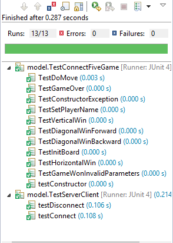
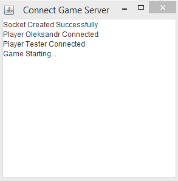
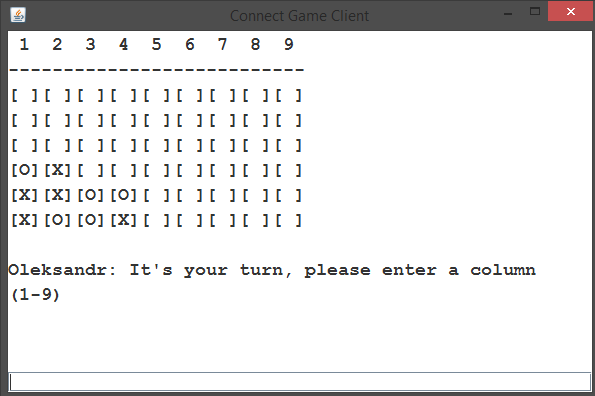

# Connect 5 Game - GenSys Challenge

A two-player connection game in which the players take turns dropping discs (symbols in this case) from the top into a nine-column, six-row vertically suspended grid. The pieces (symbols) fall straight down, occupying the next available space within the coloumn. The objective of the game is to be the first to form a horizontal, vertical or diagonal line of five of one's own symbols.

## Base Features/Requirements
- Implemented using Java programming langauge, Eclipse IDE and JUnit testing framework.
- Server application holds state and business logic of the game, recieving the movements from the players and deciding whether the game is over or won.
- Client application will receive and send data to the server _(e.g. game state, player turn, messages, etc)_.
- Server/Client communication is over HTTP and is achieved using Java socket programming.
- When server starts it waits for two players to connect. If one of the players diconnects the game is over _(all connections are checked after every valid move)_.
- The server establishes an initial connection with a prompt to the client for player name, then it displays whether waiting for more players or the game can start.
- On each turn, the server sends the client game board state and prompts the active current user for input _(or informs the player to wait until the other player makes a move)_.
- Client receives input from text field.
- Client displays when the game is over and who won _(if any)_.

## Additions
- Java swing for GUI.
- Players symbol is displayed by the client before the game starts.
- Client text field _(for player input)_ is enabled only through server request, **i.e. when the current player needs to make a move**, otherwise text field is disabled to prevent needless input.
- Model-View-Controller design allows for easier alternations/changes _(e.g. changing the view to something else)_.
- Designed to allow for easy player expansion _(can support more than two players)_.
- `IGame` interface allows for other variations of **Connect-X-in-a-Row** type games to be easily made.

# Testing
Testing framework used is JUnit for testing, the two main class models tested are `ConnectFiveGame` and `ServerClient` with test classes `TestConnectFiveGame` and `TestServerClient` respectively.

# How To Run
Example build of the **Connect 5** game is configured to run on `localhost` by default with only 2 players, to change this to another address you need to change the constant `CONNECTION_ADDRESS` in `/src/controller/ConnectGameClient.java` to whatever address you want and rebuild the project.

Executing the `/build/server.jar` will open the server window. As the default build is set to 2 players, you need to execute `/build/client.jar` for both players.

# Screenshots

